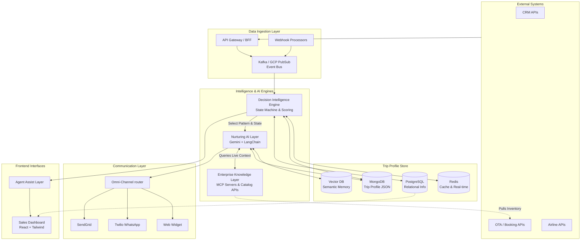
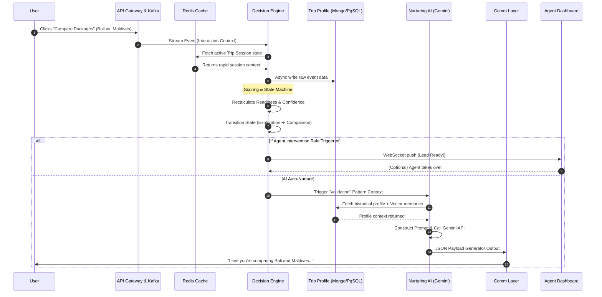

# TripNour - System Architecture & Real-Time Data Flow

## 1. High-Level Architecture Overview

TripNour operates as a domain-specific intelligence layer that integrates over existing systems (CRMs, OTAs, Booking engines). It is built as an event-driven, microservices-oriented platform optimized for low-latency decisioning (< 500ms).

### Core Components

1. **Ingestion Layer**: 
   - Acts as the entry point for all behavioral signals, user inputs, and system triggers.
   - Utilizes **Apache Kafka (or GCP PubSub)** for high-throughput, decoupled event streaming.
2. **Trip Profile Store**:
   - The central memory of the system.
   - Uses a **Polyglot Persistence Layer**:
     - **PostgreSQL**: For structured, relational data (User account, basic properties, deterministic state).
     - **MongoDB**: For flexible JSON document structures containing the evolving "Trip Profile" state.
     - **Pinecone / Weaviate**: Vector DB for storing conversational context, intent vectors, and semantic memory for the LLMs.
     - **Redis**: For ultra-fast caching and real-time state flags.
3. **Decision Intelligence Engine**:
   - A stateless compute service (e.g., Node.js or Python FastAPI).
   - Evaluates the current Trip Profile against streaming events.
   - Calculates dynamic scores (Intent, Readiness, Confidence).
   - Transitions the user through the decision state machine (Curiosity → Exploration → Narrowing → Comparison → Decision → Closure).
4. **Nurturing AI Layer (LLM Orchestration)**:
   - Orchestration powered by **LangChain / LlamaIndex** integrated with the **Gemini API**.
   - Responsible for generating the Next-Best-Action (NBA) and conversational responses based on the Nurturing Pattern assigned by the Decision Engine.
5. **Enterprise Knowledge Layer (MCP / RAG)**:
   - Extends the core Nurturing AI via the **Model Context Protocol (MCP)** or standard RAG APIs.
   - Dynamically ingests and retrieves real proprietary data, including live product inventory, dynamic pricing, and granular destination details.
   - Prevents the AI from hallucinating product costs and directly grounds recommendations in real-world catalog data.
6. **Agent Assist Layer & Sales Dashboard**:
   - A React-based web interface for human agents.
   - Displays real-time Trip Profiles, live system scores, and interaction histories.
   - Recommends talk-tracks and allows seamless human-in-the-loop (HITL) intervention when 'Deal Value' and 'Readiness' exceed thresholds.
7. **Communication Layer**:
   - Manages unified outbound/inbound multi-channel delivery using adapters for Web Chat, Twilio (WhatsApp/SMS), and SendGrid (Email).

## 2. Architecture Diagram

## 3. Real-Time Data Flow

This diagram illustrates the sequential flow when a user event occurs (e.g., exploring a high-value package) and how the system dynamically responds within the <500ms constraint.

